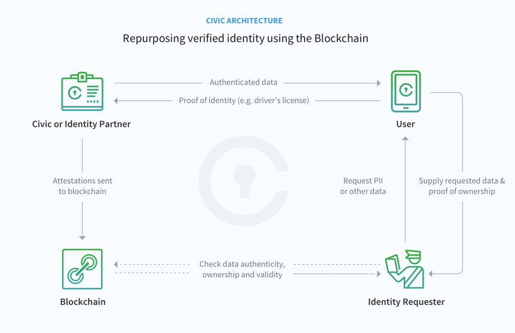
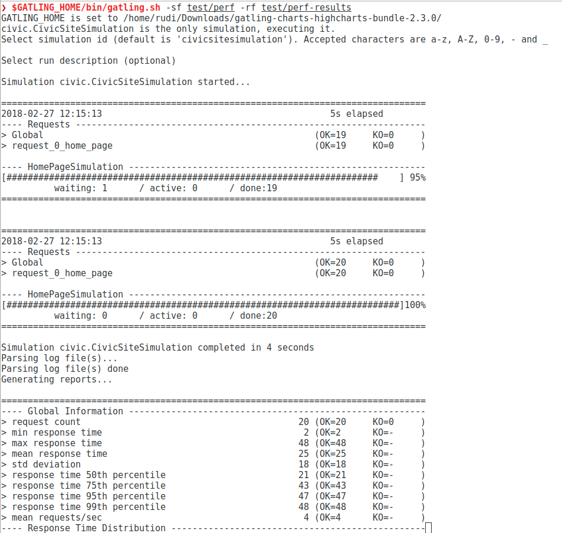
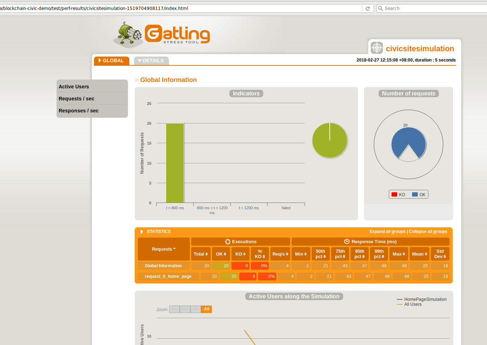

# Blockchain Decentralized ID (DID) Authentication Demo

## Overview

Web application blockchain-based decentralized ID (DID) authentication with [civic.com](civic.com)

## Prerequisites

- Docker
- Docker Compose
- Install the Civic app on your mobile device.

## Developer setup

1. Git clone the repo
2. `cd blockchain-civic-demo`

## Create Application Secrets for Local Environment

Contact a Viseo developer for access to the required application secrets.

These three files must be created. They are git ignored.

Consult the developer Keepass encrypted secrets file for the values to use:

- `test/fixtures/secrets/civic_app_id.json`
- `test/fixtures/secrets/civic_app_secret.json`
- `test/fixtures/secrets/civic_private_key.json`

**Build and start WITH Docker**

1. `docker-compose up`
2. open [http://localhost:5000](http://localhost:5000)
3. *Note:* Use `docker-compose build` to force new builds.

**Build and start WITHOUT Docker**

1. `npm install`
2. `npm start`
3. Open [http://127.0.0.1:3000](http://127.0.0.1:3000) (use IP address not localhost)

## Test

## Unit tests

- `npm test`
- `npm run test-coverage`
- `npm run test-coverage-html` (html reports in coverage/ dir)

## Integration tests - End-to-End (e2e)

Currently tests only localhost, needs a running local instance on port 3000.

- `npm run e2e`

## Performance/Stress testing with Gatling.

- Install JAVA JRE: `apt-get install default-jre`
- Download from [https://gatling.io/download/](https://gatling.io/download/)
- Unzip and set GATLING_HOME env var to point to the unzipped folder:
- Example: `export GATLING_HOME=~/Downloads/gatling-charts-highcharts-bundle-2.3.0/`
- Execute performance/stress tests and generate HTML reports:
- `cd blockchain-civic-demo`
- `$GATLING_HOME/bin/gatling.sh -sf test/perf -rf test/perf-results`
- Output screenshots:

## Deployment

Create Application Secrets inside Docker Enterprise Edition:

- [install_secrets.md](doc/install_secrets.md)

Create Docker Stack:

- SSH onto the virtual machine
- Download the docker-compose.prod.yml file
- `curl -o docker-compose-civic-app.yml https://raw.githubusercontent.com/viseo-asia/blockchain-civic-demo/master/docker-compose.prod.yml`
- Deploy the stack
- `docker stack deploy -c docker-compose-civic-app.yml civic`

The stack will be created, but the deployment will fail as we need to build and create the docker image and push it to the Docker Trusted Registry.

We'll do this is our Continuous Integration server - Jenkins

- [install_continuous_integration_jobs.md](doc/install_continuous_integration_jobs.md)
