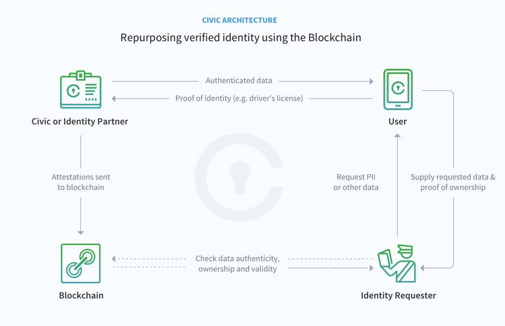

# Blockchain Authentication with Civic Demo

## Overview

Blockchain web application authentication with [civic.com](civic.com)

## Prerequisites

Install the Civic app on your mobile device.

## Developer setup

1. Git clone the repo
2. `cd blockchain-civic-demo`
3. `npm install`
4. `npm start`
5. Open [http://127.0.0.1:3000](http://127.0.0.1:3000) (use IP address not localhost)

## Test

- `npm test`
- `npm run test-coverage` (html reports in coverage/ dir)