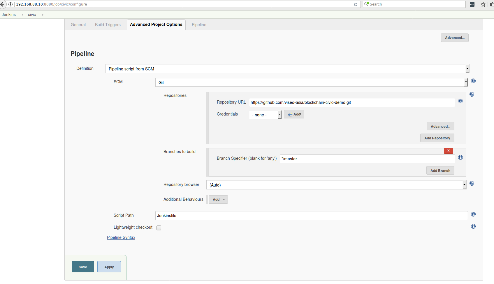

## Setup Continous Integration - Jobs

## Job: Civic App

1. Create a new job: *Jenkins* > *New Item* >
    - Name: civic
    - Select 'Pipeline' for type
    - Click 'OK'
4. Scroll down to **Pipeline** and select *Pipeline script from SCM* for the Definition
    - Select *Git* for the **SCM**
    - Repository URL = *https://github.com/viseo-asia/blockchain-civic-demo.git*
    - Click **Save**
5. Click **Build Now**

